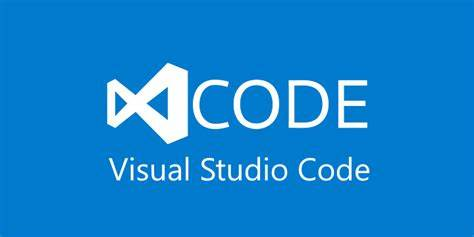

# Pelajari-VS-Kode

***Buka [Pelajari Kode VS](https://www.learnvscode.com) untuk mempelajari semua yang perlu Anda ketahui tentang editor paling populer dalam Pengembangan Web***

Hanya dalam beberapa tahun, Visual Studio Code telah menjadi editor paling populer untuk Pengembangan Web. Singkatnya, ini open source, lintas platform, penuh fungsionalitas, dan memiliki komunitas luar biasa di belakangnya. Banyak nama besar di bidang Pengembangan Web telah beralih, dan Anda juga harus melakukannya! Jika Anda ingin mempelajari seluk beluk VS Code sekaligus meningkatkan efisiensi dan kemahiran Anda sebagai pengembang, kursus ini sangat cocok untuk Anda. Baik Anda baru mengenal Pengembangan Web atau sudah berpengalaman, selalu ada sesuatu untuk semua orang.

> Referensi pintasan akan menggunakan ctrlCmd untuk mewakili tombol kontrol di Windows dan tombol Command di Mac. Jika shortcut pada Windows vs Mac berbeda maka akan dipisahkan dengan tanda '|' karakter, dengan Mac diutamakan.

## Contoh Proyek untuk digunakan Selama Demo

***================== =============== ****
- Bangun Aplikasi Kuis dengan HTML, CSS, dan JavaScript - https://github.com/jamesqquick/Build-A-Quiz-App-With-HTML-CSS-and-JavaScript
- Rancang dan Bangun Aplikasi Obrolan dengan Socket.io - https://github.com/jamesqquick/Design-and-Build-a-Chat-Application-with-Socket.io
- Alat Pencerah/Gelap Warna - https://github.com/jamesqquick/lighten-darken-color-tool

***================== ====================***

## 1. [Memulai](./GettingStarted.md)

Di bagian ini, kita akan membahas sumber daya yang tersedia, apa dan mengapa di balik VS Code, serta cara mengunduh dan menginstal.

[Pelajari lebih lanjut](./LayoutsAndShortcuts.md)

## 2. [Tata Letak dan Pintasan](./LayoutsAndShortcuts.md)

Di bagian ini, kita akan membuka VS Code terlebih dahulu dan menjelajahi tata letaknya. Kami akan menjelajahi berbagai pintasan untuk menyesuaikan tata letak Anda, bekerja dengan file, memanipulasi teks, dan banyak lagi.

[Pelajari lebih lanjut](./LayoutsAndShortcuts.md)

## 3. [Kustomisasi](./Customization.md)

Di bagian ini, kita akan mempelajari cara menyesuaikan editor Anda melalui peta kunci/pintasan, pengaturan, ekstensi, dan tema!

[Pelajari lebih lanjut](./Customization.md)

## 4. [Menulis dan Memformat Kode](./WritingAndFormattingCode.md)

Di bagian ini, kita mempelajari cara membuat cuplikan, bekerja dengan dokumen Markdown, mengatur kode, memformat kode, dan kode lint.

[Pelajari lebih lanjut](./WritingAndFormattingCode.md)

## 6. [Terminal Terintegrasi](./IntegratedTerminal.md)

Di bagian ini, kita akan mempelajari cara menggunakan dan menyesuaikan terminal terintegrasi.

[Pelajari lebih lanjut](./IntegratedTerminal.md)

## 7. [Bekerja Dengan Git](./WorkingWithGit.md)

Di bagian ini, kita akan mempelajari cara memanfaatkan alat bawaan untuk Git serta ekstensi yang berguna untuk bekerja dengan Git.

[Pelajari lebih lanjut](./WorkingWithGit.md)

## 8. [Debugging](./Debugging.md)

Di bagian ini, kita akan mempelajari cara men-debug JavaScript front-end dan JavaScript back-end serta aplikasi Angular, React, dan Vue.

[Pelajari lebih lanjut](./Debugging.md)

## 9. [Ekstra](./Extras.md)

Di bagian ini, kita akan belajar tentang tambahan lain-lain. fitur kode VS.

[Pelajari lebih lanjut](./Extras.md)
